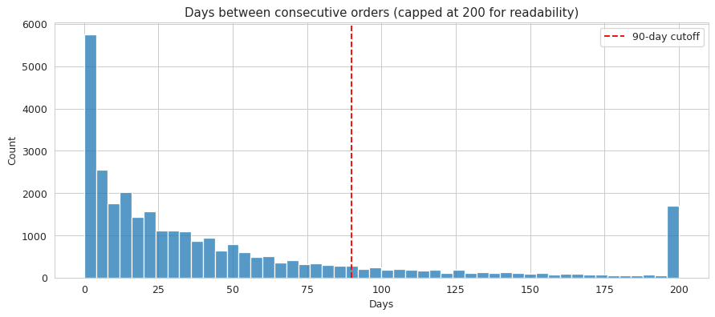
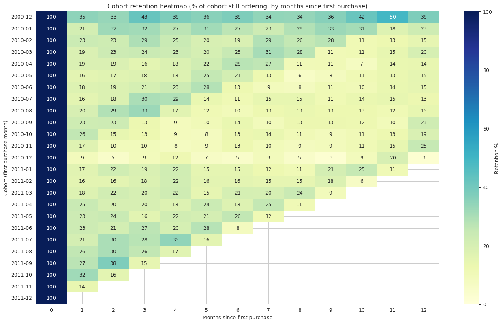
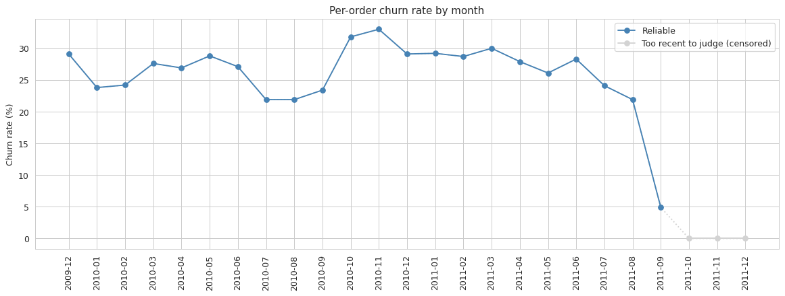
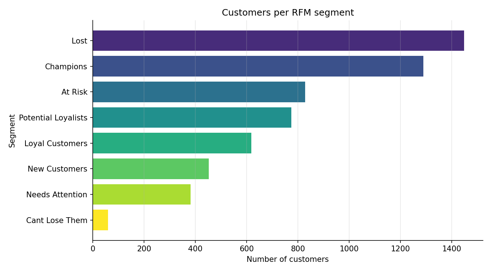

# Customer Retention Analysis

Diagnosing repeat purchase decline for a UK based online gift retailer, using two years of real transaction data.

## Overview

This project answers a question that most retailers without a subscription model cannot answer on their own: who is leaving, when they leave, and what it is costing the business. There is no cancel button and no formal churn event, so a customer simply stops ordering and the business is usually the last to notice.

Using transaction level data from December 2009 to December 2011, this project builds a full pipeline from raw order data to a customer level retention model, and packages the results into a set of SQL queries, an interactive Power BI dashboard, and a written insights summary.

The analysis covers 1.05 million line items and 5,852 identified customers across more than 40 countries, and answers four core questions:

- What counts as a lost customer, and how long a silence has to run before it counts as churn
- Which customers are gone, drifting, or healthy, in terms specific enough to act on today
- Whether newer customers are retained better or worse than customers who joined earlier
- What a churned customer is actually worth, so any retention effort can be weighed against its cost

## Key Findings

- **72.4%** of identified customers placed more than one order. Repeat buying is already the norm, not the exception.
- **50.7%** of customers have gone quiet for 90 or more days, the cutoff chosen from the actual gap between consecutive orders in the data, not an arbitrary round number.
- **87%** of revenue is traceable to a named customer. The remaining 13% comes from guest checkout, where no customer ID is ever captured, which is a data gap worth fixing at the source.
- Most of the drop off in a customer relationship happens in the **first two months**. Retention is largely won or lost in that early window, not later on.
- **59 high value customers** who have gone quiet represent **£3.30M** in revenue at risk, and are named specifically enough to build a win back campaign around today.

Full findings, charts, and caveats are in `insights/customer_retention_analysis.pdf`.

## Repository Structure

```
customer-retention-analysis/
│
├── README.md
├── LICENSE
│
├── datasets/
│   ├── raw/
│   │   └── online_retail_II.csv.gz           Original, unmodified source file
│   │
│   ├── cleaned/
│   │   ├── orders_clean_full.csv.gz            Full cleaned order data, 1,003,386 rows
│   │   ├── orders_cancellations.csv           Cancelled product lines, kept separately
│   │   ├── orders_guest_only.csv               Orders with no Customer ID, revenue and product level use only
│   │   └── orders_clean_customer_level.csv.gz   Identified customers only, used for RFM, churn, and cohort work
│   │
│   ├── derived/
│   │   └── customer_segments.csv              One row per customer, with RFM scores, segment, churn flag, and cohort month
│
├── problem_statement/
│   └── problem_statement.pdf                  Project brief and scope
│
├── assumptions/
│   └── assumptions_log.md                     Every cleaning and modeling decision, in order, with the reasoning behind it
│
├── python/
│   ├── 01_data_cleaning.ipynb                  Raw data to clean, analysis ready tables
│   ├── 02_eda.ipynb                            Exploratory analysis and early data checks
│   ├── 03_rfm_churn_cohort.ipynb               RFM scoring, churn definition, cohort retention
│   └── figures/                                 Chart exports referenced in this README
│       ├── churn_cutoff_derivation.png
│       ├── cohort_retention_heatmap_full.png
│       ├── monthly_churn_rate_censoring.png
│       ├── order_value_distribution.png
│       └── segment_counts.png
│
├── sql/
│   ├── business_queries.sql                    Core business questions, written in SQL
│   └── query_results.md                        Query output with commentary
│
├── dashboard/
│   ├── customer_retention_dashboard.pbix        Interactive Power BI dashboard
│   └── screenshots/
│       ├── 1_overview.png
│       ├── 2_segments.png
│       ├── 3_watchlist.png
│       ├── 4_cohort_retention.png
│       └── 5_data_quality_and_cancellations.png
│
└── insights/
    └── customer_retention_analysis.pdf          Executive summary of findings and recommendations
```

## Data Source

The raw data is the [Online Retail II dataset](https://archive.ics.uci.edu/dataset/502/online+retail+ii), transaction records from a UK based online retailer of all occasion giftware, covering December 2009 to December 2011. The business mixes casual, one time gift buyers with wholesale accounts placing large repeat orders, which the segmentation work accounts for directly.

## Methodology

### 1. Data Cleaning

Starting from 1,067,371 raw rows, the cleaning pipeline in `01_data_cleaning.ipynb` removed non-product stock codes, cancelled product lines, stock write-offs, rows with zero or negative price, and exact duplicates, arriving at 1,003,386 clean rows. Orders with no Customer ID were set aside into a separate guest orders table rather than dropped, since they still matter for revenue and product level questions even though they cannot be tracked over time. Every step, including exact row counts before and after, is recorded in `assumptions/assumptions_log.md`.

### 2. Exploratory Analysis

`02_eda.ipynb` covers monthly revenue trends, the seasonal pattern typical of a gift retailer, and the split between revenue from identified customers versus guest checkout, which turned out to be 87% versus 13%.

### 3. RFM Segmentation, Churn, and Cohorts

`03_rfm_churn_cohort.ipynb` builds Recency, Frequency, and Monetary scores for every identified customer, then assigns each one to a segment such as Champions, At Risk, or Lost. The 90 day churn cutoff was chosen by checking the actual gap between consecutive orders across every repeat customer, then picking a cutoff that sits past normal reorder behavior without over-flagging slower but still active buyers. Cohort retention tracks each customer from their first order forward, month by month, to see whether newer customers are retained better than earlier ones.

### 4. Business Queries

`sql/business_queries.sql` answers the core business questions directly in SQL: monthly revenue, repeat versus one time customers, top spenders, month over month change, and cohort assignment. Results and commentary are recorded in `sql/query_results.md`.

### 5. Dashboard

The Power BI dashboard in `dashboard/customer_retention_dashboard.pbix` brings everything together across six pages: an executive overview, customer segments, customer level detail, a prioritized watchlist of high value at risk accounts, cohort retention, and a data quality page that documents the scope and limits of the analysis. Date, segment, and country filters are synced across every page, so a selection made on one page carries through to the rest.

## Notebook Highlights

A few charts from the Python notebooks are included here because they show the reasoning behind decisions that the dashboard states as conclusions. Full analysis lives in `python/`.

**How the 90 day churn cutoff was chosen.** Rather than picking a round number, the cutoff came from plotting the actual gap between consecutive orders across every repeat customer. Ninety days sits past normal reorder behavior without flagging customers who are simply slower, more occasional buyers.



**The full cohort retention heatmap.** The dashboard version only has room to show a handful of cohort rows. This version shows all 24 months, and makes the censoring pattern visible directly: the empty triangle in the bottom right is recent cohorts that simply have not had time to reorder yet, not customers who churned.



**Monthly churn rate, with the censored months flagged.** The sharp drop at the right edge of the chart is not a real improvement in retention. It is the same censoring effect from the cohort heatmap, shown from a different angle.



**Customers per RFM segment**, generated from the final, corrected `customer_segments.csv` after the Needs Attention segment rule was widened (see `assumptions/assumptions_log.md`).



## Honesty About the Data

About a fifth of all orders have no customer identifier attached, so they cannot be tied to a specific person over time. Those orders are kept for revenue and product level analysis but excluded from anything that tracks an individual customer, which is why the retention numbers in this project describe roughly 87% of revenue rather than the full business. That gap points at a real data capture problem at checkout, not just a limitation of the analysis, and is called out directly in both the dashboard and the insights summary rather than glossed over.

The most recent two to three months in the dataset are also censored. Customers who first ordered near the end of the observation window have not had enough time to reorder yet, so churn and retention figures for those months read artificially favorable and should not be compared directly to earlier months.

## Tools Used

- **Python** (pandas, numpy) for data cleaning, RFM scoring, and cohort analysis
- **SQL** (MySQL) for business query validation
- **Power BI** for the interactive dashboard
- **Jupyter Notebooks** for the full analytical workflow

## Getting Started

1. Clone the repository
2. Review `problem_statement/problem_statement.pdf` for project scope and context
3. Run the notebooks in `python/` in order, starting with `01_data_cleaning.ipynb`
4. Open `dashboard/customer_retention_dashboard.pbix` in Power BI Desktop to explore the interactive version
5. Read `insights/customer_retention_analysis.pdf` for the full write-up of findings and recommendations

## License

See `LICENSE` for details.
